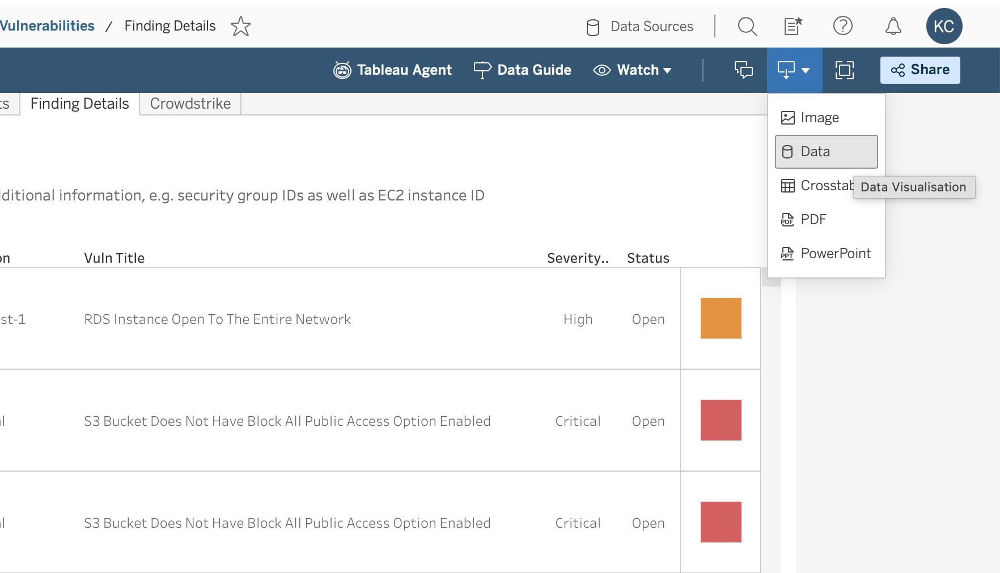
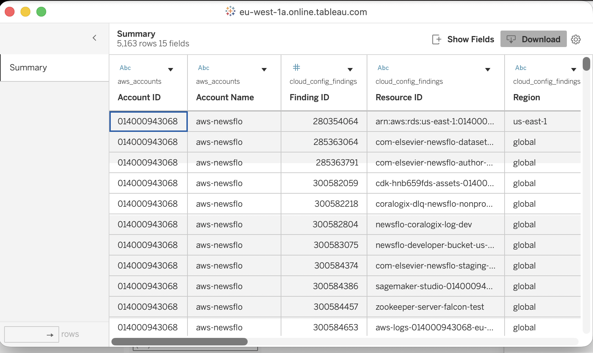
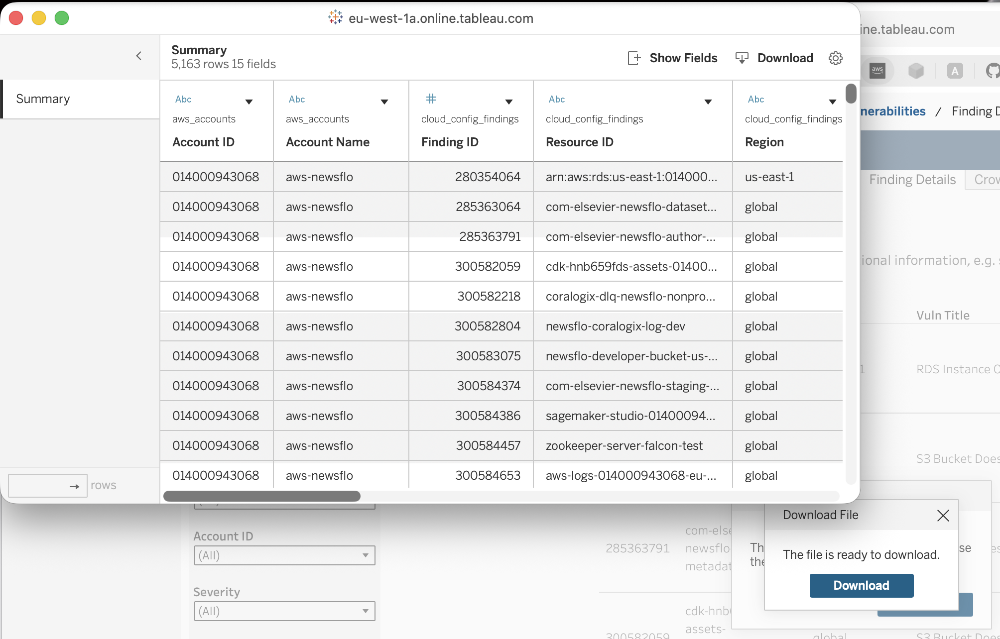

# Quickstart

This tool reads a Tableau-exported findings CSV, groups AWS vulnerability findings, collects resource metadata and tags, and writes an enriched CSV plus JSONL activity logs.

The input file is UTF-16 and tab-delimited even though it uses a `.csv` extension. The parser handles that automatically.

## 1. Download the Tableau Data

Download the source data from Tableau before running the program.

Source view:

```text
https://eu-west-1a.online.tableau.com/#/site/elseviertableau/views/CloudInfrastructureConfigVulnerabilities_17231465156160/FindingDetails?:iid=1
```

Steps:

1. Open the Tableau view and go to the `Finding Details` tab.
2. Click the download icon in the top toolbar.
3. In the download menu, choose `Data`.
4. In the data window, confirm the `Summary` table is selected.
5. Click `Download`.
6. When Tableau shows `The file is ready to download`, click `Download` again.
7. Move the downloaded CSV into this project folder.

The screenshots below show the flow:

**Step 1: Choose `Data` from the Tableau download menu**



**Step 2: Review the `Summary` data table**



**Step 3: Click the final `Download` button when the file is ready**



Use a clear filename for the downloaded export, for example:

```text
input/cloud-config-findings.csv
```

Then pass that file explicitly:

```bash
python3 run_findings_metadata.py \
  -i input/cloud-config-findings.csv \
  -d \
  -n 5
```

Or using the long form:

```bash
python3 run_findings_metadata.py \
  --input-file input/cloud-config-findings.csv \
  --dry-run \
  --limit 5
```

## 2. Install Dependencies

Use Python 3.11 or newer.

```bash
python3 -m venv .venv
source .venv/bin/activate
python3 -m pip install -r requirements.txt
```

## 3. Smoke Test Without AWS

Run a dry-run first. This verifies parsing, grouping, logging, output CSV writing, and console progress without calling AWS APIs.

```bash
python3 run_findings_metadata.py -d -n 5
```

Expected outputs:

- `output/enriched-findings-<timestamp>.csv`
- `logs/enriched-findings-<timestamp>.jsonl`

## 4. Check Your AWS Identity

Before a real run, check which account your current/default credentials point to:

```bash
aws sts get-caller-identity
```

You do not need to create a new profile if your current AWS credentials already point to the account being processed.

## 5. Run With Current AWS Credentials

Use this mode when you want the program to reuse your current/default credentials and prompt you when it reaches an account that needs different credentials.

```bash
python3 run_findings_metadata.py -p default
```

If the current credentials are not for the account being processed, the program will:

1. Show available AWS profiles if any exist.
2. Let you choose a profile by number or name.
3. Verify the selected profile with `sts:GetCallerIdentity`.
4. Continue processing if the selected credentials match the account.
5. Let you press Enter after manually switching default credentials in another terminal.
6. Let you type `q`, `quit`, or `skip` to skip that account and continue.

Run this from a real interactive terminal. Non-interactive IDE runners may not support the profile picker.

## 6. Run With Account-ID Profiles

Use this if your AWS CLI profile names follow a predictable pattern based on the account ID or account name (e.g., `prod-account`, `nonprod-account`, `account-name-env`).

Note: This strategy assumes profile names exactly match account IDs, which is uncommon. Most organizations use meaningful names instead. If your profiles use meaningful names, skip to Step 7 to use a profile map.

```bash
python3 run_findings_metadata.py -p account_id_profile
```

This strategy is rarely used in practice since profile names are typically meaningful identifiers rather than raw account IDs.

## 7. Run With a Profile Map

Use a profile map when your profile names are friendly names instead of account IDs.

Create `profiles.csv`:

```csv
account_id,profile
023759106857,my-prod-profile
852247674792,my-nonprod-profile
```

Then run:

```bash
python3 run_findings_metadata.py -p named_profile_map -m profiles.csv
```

JSON profile maps are also supported:

```json
{
  "023759106857": "my-prod-profile",
  "852247674792": "my-nonprod-profile"
}
```

## 8. Useful Options

```bash
python3 run_findings_metadata.py --help
```

Common options:

- `-i`, `--input-file PATH`: input findings CSV file.
- `-o`, `--output-file PATH`: write the enriched CSV to an explicit path.
- `-l`, `--log-file PATH`: write JSONL activity logs to an explicit path.
- `-p`, `--aws-profile-strategy STRATEGY`: profile strategy (default, account_id_profile, named_profile_map, sso_account_role).
- `-m`, `--profile-map-file PATH`: profile map file (CSV or JSON).
- `-r`, `--default-region REGION`: region used for STS checks. Resource metadata still uses each finding's region.
- `-d`, `--dry-run`: skip AWS calls and write output rows with `metadata_status=dry_run`.
- `-n`, `--limit N`: process only the first `N` valid findings.
- `--max-retries N`: retry count for transient AWS metadata errors.
- `--no-sso-login`: do not run `aws sso login` automatically for selected profiles.
- `--no-interactive-account-switch`: fail/skip instead of prompting for credential selection.

## 9. Outputs

Enriched CSV:

```text
output/enriched-findings-<timestamp>.csv
```

Activity and error log:

```text
logs/enriched-findings-<timestamp>.jsonl
```

The timestamp is generated once at run start in UTC, using the format `YYYYMMDDTHHMMSSZ`, so the CSV and log files from the same run are easy to match.

Each input finding produces one output row, even when auth or metadata lookup fails.

Important output fields:

- `metadata_status`: `ok`, `dry_run`, `account_auth_error`, `not_found_or_unsupported`, or `error`.
- `metadata_error`: error details when metadata collection fails.
- `resource_name`: EC2 `Name` tag when present.
- `tags_json`: all resource tags as compact JSON.
- `metadata_json`: selected AWS metadata as compact JSON.

## 10. Verify Locally

Run the parser test:

```bash
python3 -m unittest discover -s tests
```

Run a syntax check:

```bash
python3 -m py_compile \
  aws_findings_metadata/agents.py \
  aws_findings_metadata/cli.py \
  run_findings_metadata.py \
  tests/test_ingestion.py
```
